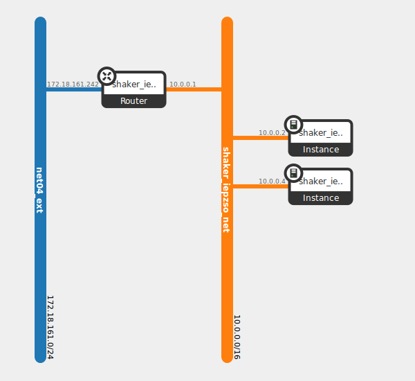

L2 Same Domain
--------------

This scenario tests the bandwidth between pairs of instances in the same virtual network (L2 domain).
Each instance is deployed on own compute node. The test increases the load from 1 pair until all
available instances are used.

How To Run
^^^^^^^^^^
.. code::

    shaker --server-endpoint <host:port> --scenario openstack/full_l2 --report <full_l2.html>

Scenario
^^^^^^^^

.. literalinclude:: ../../../shaker/scenarios/openstack/full_l2.yaml

Report
^^^^^^

Example report collected at 20-nodes OpenStack cluster: :ref:`openstack_l2`.
