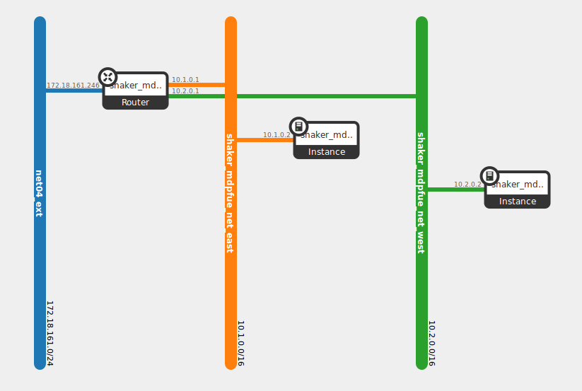

L3 East-West
------------

This scenario tests the bandwidth between pairs of instances deployed in different virtual networks
plugged into the same router. Each instance is deployed on its own compute node. The test increases the load
from 1 pair pair until all available instances are used.

How To Run
^^^^^^^^^^
.. code::

    shaker --server-endpoint <host:port> --scenario openstack/full_l3_east_west --report <full_l3_east_west.html>

Scenario
^^^^^^^^

.. literalinclude:: ../../../shaker/scenarios/openstack/full_l3_east_west.yaml

Report
^^^^^^

Example report collected at 20-nodes OpenStack cluster: :ref:`openstack_l3_east_west`.
