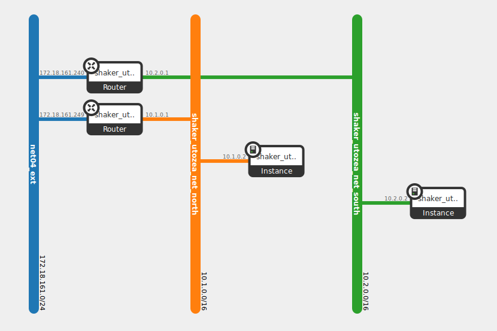

L3 North-South
--------------

This scenario tests the bandwidth between pairs of instances deployed in different virtual networks. Instances
with master agents are located in one network, instances with slave agents are reached via their floating IPs.
Each instance is deployed on its own compute node. The test increases the load from 1 pair pair until
all available instances are used.

How To Run
^^^^^^^^^^
.. code::

    shaker --server-endpoint <host:port> --scenario networkingfull_l3_north_south --report <full_l3_north_south.html>

Scenario
^^^^^^^^

.. literalinclude:: ../../../shaker/scenarios/openstack/full_l3_north_south.yaml

Report
^^^^^^

Example report collected at 20-nodes OpenStack cluster: :ref:`openstack_l3_north_south`.
