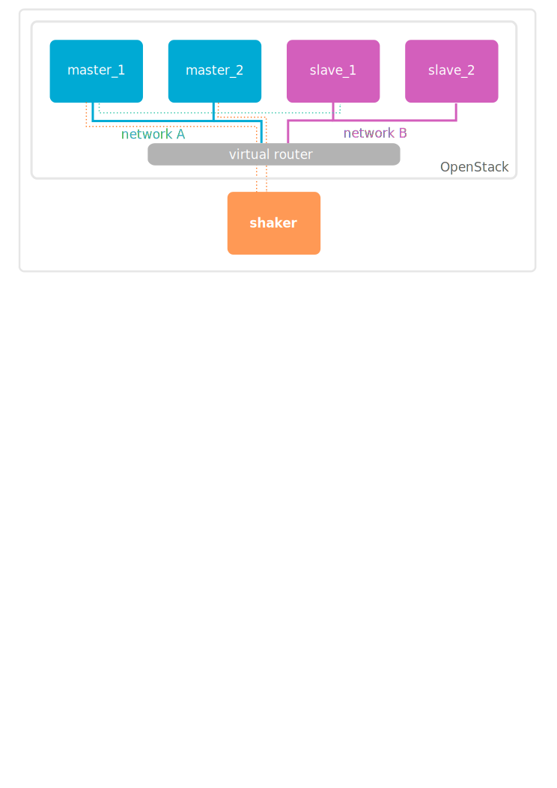

============
Installation
============

Installation in Python environment
^^^^^^^^^^^^^^^^^^^^^^^^^^^^^^^^^^

Shaker is distributed as Python package and available through PyPi (https://pypi.python.org/pypi/pyshaker/).
It is recommended to be installed inside virtualenv.

.. code::

    $ virtualenv venv
    $ . venv/bin/activate
    $ pip install pyshaker

Installation on Ubuntu Cloud Image
^^^^^^^^^^^^^^^^^^^^^^^^^^^^^^^^^^

Installation on fresh system requires additional libraries needed by some of dependencies.

.. code::

    $ sudo apt-add-repository "deb http://nova.clouds.archive.ubuntu.com/ubuntu/ trusty multiverse"
    $ sudo apt-get update
    $ sudo apt-get -y install python-dev libzmq-dev
    $ wget -O get-pip.py https://bootstrap.pypa.io/get-pip.py && sudo python get-pip.py
    $ sudo pip install pbr pyshaker
    $ shaker --help

Deployment
^^^^^^^^^^

Requirements:

    * User with admin privileges OpenStack cloud
    * Computer where shaker is executed should be routable from OpenStack instances
    * Open port to accept connections from agents running on instances

First Run
^^^^^^^^^

Build the master image. The process downloads Ubuntu cloud image, installs all necessary packages and stores
snapshot into Glance. This snapshot is used by ``shaker`` as base of instances.

.. code::

    $ shaker-image-builder

