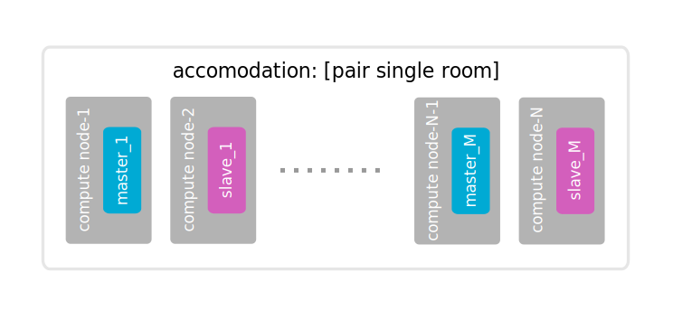
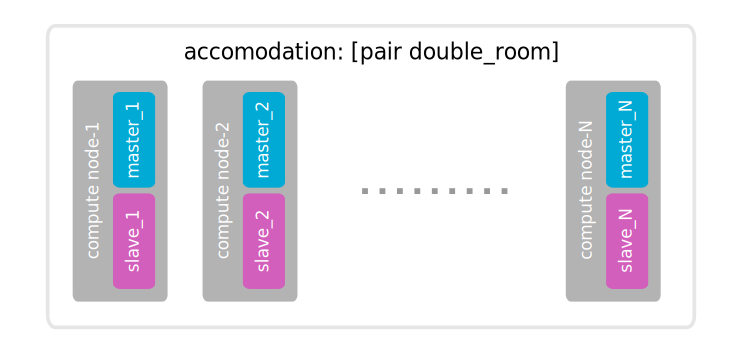

=====
Usage
=====

Configuration
-------------

The connection to OpenStack is configured using standard ``openrc`` file. (Refer to
http://docs.openstack.org/cli-reference/content/cli_openrc.html on how to retrieve it)

The config can be passed to Shaker rather by sourcing into system env ``source openrc``
or via set of CLI parameters ``--os-tenant-name``, ``--os-username``, ``--os-password``,
``--os-auth-url`` and ``--os-region-name``. Note that Shaker requires a user with admin privileges.

Scenario Explained
------------------

Shaker scenario is file in YAML format. It describes how agents are deployed
(at OpenStack instances or statically) and sequence of tests to execute. When agents
are deployed at OpenStack instances a reference to Heat template is provided.

.. code::

    description:
      This scenario launches pairs of VMs in the same private network. Every VM is
      hosted on a separate compute node.

    deployment:
      template: l2.hot
      accommodation: [pair, single_room]

    execution:
      size: quadratic_progression
      tests:
      -
        title: Iperf TCP
        class: iperf_graph
        time: 60

Deployment
^^^^^^^^^^

By default Shaker spawns  instances on every available compute node. The distribution
of instances is configured by parameter ``accommodation``. There are several instructions
that allow control the scheduling precisely:

    * ``pair`` - instances are grouped in pairs, meaning that one can be used as source of traffic and the other as a consumer (needed for networking tests)
    * ``single_room`` - 1 instance per compute node
    * ``double_room`` - 2 instances per compute node
    * ``density: N`` - the multiplier for number of instances per compute node
    * ``compute_nodes: N`` - how many compute nodes should be used (by default Shaker use all of them)

Examples:

As result of deployment the set of agents is produced. For networking testing this set contains
agents in ``master`` and ``slave`` roles. Master agents are controlled by ``shaker`` tool and execute commands.
Slaves are used as back-ends and do not receive any commands directly.

Execution
^^^^^^^^^

The execution part of scenario contains a list of tests that are executed one by one. By default Shaker runs the test
simultaneously on all available agents. The level of concurrency can be controlled by option ``size``. There are
3 values available:

    * ``size`` is not specified - all agents are involved;
    * ``size: linear_progression`` - the execution starts with 1 agent and increases by 1 until all agents are involved;
    * ``size: quadratic_progression`` - the execution starts with 1 agent (or 1 pair) and doubles until all agents are involved.

Tests are executed in order of definition. The exact action is defined by option ``class``, additional attributes are provided
by respective parameters. The following classes are available:

    * ``iperf_graph`` - runs ``iperf`` tool and shows chart and statistics
    * ``netperf_wrapper`` - runs ``netperf-wrapper`` and shows chart and statistics
    * ``iperf`` - runs ``iperf`` tool and shows plain output
    * ``netperf`` - runs ``netpers`` tool and shows plain output
    * ``shell`` - runs any shell command or process and shows plain output

